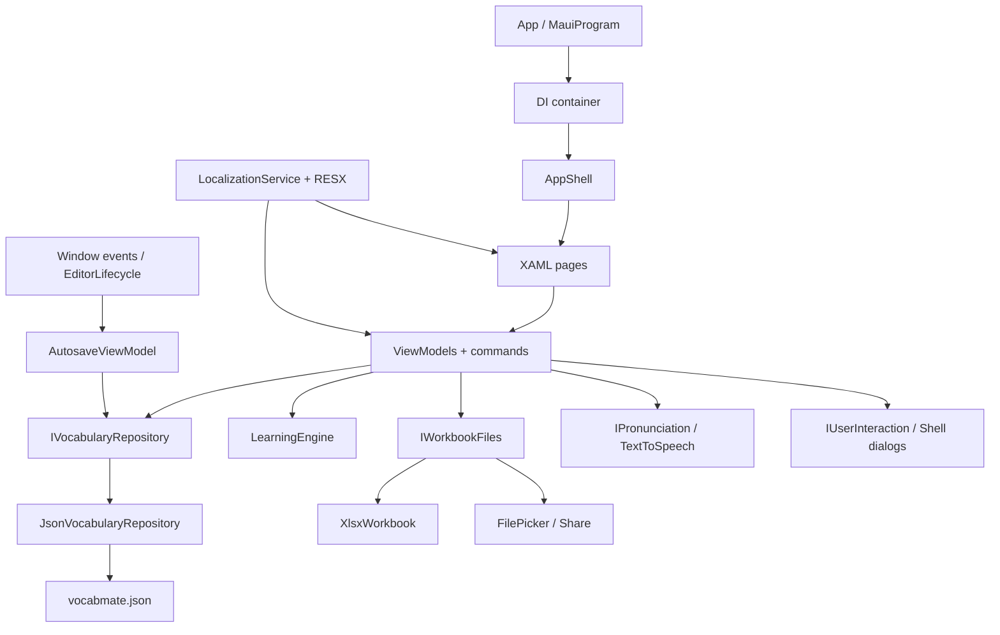

# VocabMate — architecture và flow chức năng

Tài liệu mô tả **code đang triển khai**, không chỉ là ý tưởng. Mốc cập nhật: 17/09/2026. Namespace/project vẫn là `MauiApp1`; tên ứng dụng là **VocabMate**.

## 1. Phạm vi và quyết định chính

- Ứng dụng local, một người dùng trên thiết bị; không có backend, login hoặc đồng bộ cloud.
- `Class` là nhóm bộ từ, không phải lớp online có giáo viên/thành viên.
- Ngôn ngữ UI (Anh/Việt) độc lập với chiều học (Anh → Việt hoặc Việt → Anh).
- Một file JSON riêng `vocabmate.json`, không chuyển đổi hoặc xóa `studymate.json`.
- Một phiên học đang dở toàn app; bắt đầu phiên mới cần xác nhận thay thế phiên cũ.
- Mỗi lượt lấy ngẫu nhiên tối đa 20 câu; ghép cặp tối đa 6 cặp. Lượt sau có thể gặp lại từ cũ; chưa có thuật toán spaced repetition.
- Lưu tối đa 100 kết quả gần nhất trên toàn app. Thẻ và bộ từ không bị xóa theo giới hạn lịch sử.
- Dùng một MAUI project với các thư mục theo trách nhiệm, chưa tách thành nhiều assembly hoặc áp dụng toàn bộ Clean Architecture.

## 2. Sơ đồ kiến trúc



### Trách nhiệm từng phần

| Thành phần | Trách nhiệm | Không nên làm |
| --- | --- | --- |
| `Views/*.xaml`, `MainPage.xaml` | Layout, binding, template, semantic labels | Đọc JSON, chấm đáp án |
| Code-behind của page | Gắn ViewModel, nhận query ID, chuyển tiếp xuất hiện/rời trang | Chứa nghiệp vụ CRUD |
| `ViewModels` | Trạng thái màn hình, command, gọi service, chuẩn bị dữ liệu hiển thị | Tự tạo repository hoặc truy cập UI native trực tiếp |
| `VocabularyRules` | Quy tắc tên/thẻ và chuẩn hóa chuỗi | Chọn ngôn ngữ giao diện |
| `LearningEngine` | Tạo câu hỏi, chấm bài, chuyển bước, ghép cặp | File I/O, dialog hoặc Shell navigation |
| `JsonVocabularyRepository` | Quan hệ dữ liệu, validation bảo vệ, persist, xóa liên đới | Hiển thị thông báo trực tiếp |
| `XlsxWorkbook` | Đọc/ghi cấu trúc XLSX bằng ZIP/XML | Mở picker, thực thi macro/công thức |
| `WorkbookFiles`, `Pronunciation` | Adapter đến API thiết bị | Quyết định đáp án đúng/sai |
| `LocalizationService` | Lấy resource theo ngôn ngữ, phát tín hiệu đổi ngôn ngữ | Dịch nội dung từ do người dùng nhập |

### DI và lifetime

`MauiProgram.cs` đăng ký repository, engine, localization, lifecycle và các adapter dưới dạng singleton. Trang gốc Library, Results, Settings và ViewModel tương ứng cũng là singleton. Class, Deck, CardEditor, Import, Learning là transient.

`App` chỉ resolve `AppShell` trong `CreateWindow`, **sau** khi load application resources và các chuỗi dịch. Không resolve page trước khi tài nguyên XAML sẵn sàng. `IServiceProvider` chỉ dùng ở composition root này, không đưa vào ViewModel.

## 3. Data model

```text
VocabularyClass 1 ── n VocabularyDeck 1 ── n VocabularyCard
                              │
                              ├── CardDraft (bản nháp mới hoặc sửa thẻ)
                              ├── LearningSession (tối đa 1 phiên hiện hành toàn app)
                              └── LearningResult (lịch sử hoàn thành)
```

| Model | Trường/ý nghĩa quan trọng |
| --- | --- |
| `VocabularyClass` | `Id`, `Name` |
| `VocabularyDeck` | `Id`, `ClassId`, `Name`, `Description` |
| `VocabularyCard` | `Id`, `DeckId`, `Vietnamese`, `English`, `IsStarred` (mặc định false cho dữ liệu cũ) |
| `CardDraft` | `CardId`, `DeckId`, `IsNew`, hai mặt đang gõ, `UpdatedAt` |
| `StudyQuestion` | `CardId`, prompt, đáp án hiển thị, các đáp án chấp nhận, lựa chọn trắc nghiệm |
| `LearningSession` | Snapshot câu hỏi, thứ tự ghép, câu đã trả lời, index, input đang gõ, mặt đã lật, thời điểm bắt đầu/kết thúc |
| `LearningResult` | Session ID, snapshot tên bộ, chế độ/chiều học, điểm, thời gian, số ghép sai và câu cần ôn |

Session lưu **snapshot**, không chỉ ID thẻ. Nhờ đó thứ tự câu hỏi/lựa chọn không đổi khi mở lại app. Sửa/xóa một thẻ không thay đổi hồi tố câu hỏi trong phiên đã tạo hoặc lịch sử; bắt đầu phiên mới để lấy nội dung mới. Xóa cả bộ/lớp sẽ xóa các phiên và kết quả liên quan sau xác nhận.

Các bản nháp mới có GUID ngay từ khi bắt đầu. Với mỗi bộ từ chỉ giữ một bản nháp tạo thẻ mới; bản nháp sửa thẻ gắn với ID thẻ. Mở lại chức năng thêm/sửa tương ứng sẽ tìm và khôi phục nháp.

## 4. Startup và navigation

```text
MauiProgram.CreateMauiApp
  → đăng ký DI + cấu hình handler
  → App: chọn ngôn ngữ, load resources, áp dụng theme
  → CreateWindow: resolve Shell, gắn lifecycle events
  → LibraryPage xuất hiện → LibraryViewModel.RefreshAsync
  → repository.ReadAsync → binding hiển thị dữ liệu
```

| Route | Đầu vào |
| --- | --- |
| `library`, `history`, `settings` | Các tab gốc |
| `class?classId=...` | GUID lớp |
| `deck?deckId=...` | GUID bộ từ |
| `card?deckId=...` | Tạo/khôi phục thẻ mới |
| `card?deckId=...&cardId=...` | Sửa/khôi phục thẻ đã có |
| `import?deckId=...` | Import vào bộ từ xác định |
| `learn` | Đọc phiên học hiện hành từ repository |

Page nhận ID bằng `IQueryAttributable`, không truyền object model qua query string. Route/ID không được dịch. Chuyển tab giữ navigation stack của tab; quay về tab Library có thể trở lại trang con đang mở, không tự pop về màn hình gốc.

## 5. Flow quản lý lớp, bộ từ, thẻ

### Tạo và đổi tên lớp/bộ

1. `Entry.Text` cập nhật property trong ViewModel.
2. Nhấn command → `ViewModelBase.RunAsync` bật `IsBusy`, ngăn thực hiện command lặp trên cùng ViewModel.
3. Repository kiểm tra tên 1–80 ký tự; tên lớp không trùng toàn thư viện, tên bộ không trùng trong cùng lớp.
4. Tên được trim; so sánh trùng không phân biệt hoa/thường, chuẩn hóa Unicode/khoảng trắng.
5. Ghi dữ liệu thành công → tải lại danh sách → thông báo property thay đổi.

Mô tả bộ tối đa 500 ký tự. Đổi tên/mô tả chỉ persist khi nhấn Lưu; không nằm trong cơ chế autosave thẻ.

### Tạo hoặc sửa thẻ

1. Nhận deck/card ID; tải bộ từ và thẻ nếu có.
2. Ưu tiên khôi phục bản nháp tương ứng, hiển thị thông báo đã khôi phục.
3. Người dùng gõ hai mặt: behavior phản hồi hợp lệ tức thời; ViewModel lên lịch lưu nháp.
4. Nhấn **Lưu từ vào bộ**: flush nháp đang chờ → repository validate thẻ → lưu thẻ và xóa nháp trong cùng lần ghi JSON.
5. Thành công mới quay về bộ từ. Lỗi giữ form để sửa/thử lại.

Mỗi mặt có 1–200 ký tự. Cặp Việt/Anh trùng trong cùng bộ bị từ chối. Hai thẻ có cùng một mặt nhưng nghĩa khác vẫn được lưu, ví dụ `book ↔ sách` và `book ↔ quyển sách`.

### Xóa và tìm kiếm

- Xóa luôn có xác nhận; hủy không thay đổi dữ liệu.
- Xóa lớp cascade các bộ/thẻ/nháp/kết quả và phiên thuộc các bộ đó.
- Xóa bộ cascade dữ liệu con tương tự, không ảnh hưởng bộ khác.
- Xóa thẻ chỉ xóa thẻ và nháp; snapshot phiên/lịch sử đã tạo giữ nguyên.
- Tìm kiếm trong hai mặt, không phân biệt hoa/thường, vẫn phân biệt dấu tiếng Việt.

## 6. Flow Excel

```text
Deck → Import → FilePicker
  → OpenReadAsync (không dựa vào đường dẫn vật lý)
  → giới hạn kích thước → ZIP/XML parser
  → WorkbookPreview → so với cặp từ đang có
  → hiển thị dòng mới / trùng / lỗi
  → xác nhận → ImportAsync ghi một lần
  → báo số từ thực sự được thêm → quay lại bộ từ
```

### Hợp đồng file

- `.xlsx`, không phải `.xls`, `.csv` hoặc workbook mã hóa bằng mật khẩu.
- Đọc sheet hiển thị đầu tiên; các sheet khác không được nhập.
- Dùng hai cột A/B. Hàng đầu có tiêu đề `Tiếng Việt`/`Vietnamese`/`vi` và `Tiếng Anh`/`English`/`en`; thứ tự có thể đảo.
- Tối đa 2.000 dòng dữ liệu sau hàng tiêu đề và 10 MB file đầu vào. Các row chỉ có format vẫn có thể được tính vào giới hạn số row vật lý.
- Dòng hoàn toàn trống bỏ qua; thiếu một mặt, nội dung quá dài, cột khác có dữ liệu hoặc công thức sẽ báo lỗi theo dòng.
- Parser hỗ trợ inline strings, rich text và shared strings; giá trị số đơn giản đọc dạng giá trị thô, không suy diễn ngày tháng từ style Excel. Nên định dạng cột từ vựng là Text.
- Không thực thi công thức, macro hoặc tải external relationship. XML cấm DTD/external entity. ZIP có giới hạn số entry, dung lượng từng entry và tổng giải nén.

### Preview và commit

`ImportViewModel` đánh dấu trùng trong file lẫn trong bộ đích. Chỉ bật nhập khi có ít nhất một dòng mới và **không còn dòng lỗi**. Dòng trùng được bỏ qua, không tự ghi đè thẻ cũ.

Repository kiểm tra lại toàn bộ batch và duplicate ở thời điểm commit; không tin hoàn toàn preview. Nếu một dòng mới không hợp lệ, batch không được ghi dở. Hủy picker không thay đổi dữ liệu. Không có dữ liệu demo tự import khi cài app.

### File mẫu và writer nội bộ

`WorkbookFiles.ShareAsync` dùng `XlsxWorkbook.Write` tạo `.xlsx` vào cache app, sau đó mở Share của hệ điều hành. Nút xuất/chia sẻ bộ hiện tại đã bỏ theo `Fix.md`; writer vẫn phục vụ **file Excel mẫu** gồm 4 cặp và các kiểm tra round-trip. File mẫu trong repo ở `Samples/VocabMate-template.xlsx` chứa 6 cặp để thử ngay.

Excel chỉ backup hai mặt của thẻ, không bao gồm lớp, bản nháp, kết quả hay phiên học. Lưu file từ share sheet phụ thuộc ứng dụng đích trên thiết bị.

## 7. Flow học và chấm bài

### Bắt đầu

`DeckViewModel` đọc dữ liệu mới nhất → `LearningEngine.Create` dựng snapshot → nếu có phiên dở thì hỏi xác nhận → `StartSessionAsync` persist → điều hướng `learn`.

Chế độ, chiều và nhóm từ được chọn trong bộ từ hoặc trong Tùy chỉnh ngay trên trang học. Thay đổi lúc phiên đang dở cần xác nhận tạo phiên mới, còn Tiếp tục phiên giữ nguyên snapshot. Engine gom các prompt giống nhau sau chuẩn hóa thành một câu với danh sách đáp án chấp nhận. Vì vậy số câu có thể nhỏ hơn số thẻ.

### Flashcards

```text
Mặt trước ↔ nhấn thẻ / Lật ↔ mặt sau
  → Đã nhớ / Chưa nhớ (có thể ở bất kỳ mặt nào)
  → lưu đánh giá + sao + index trong cùng lần ghi
  → tự hiện thẻ tiếp theo → hết câu → kết quả
  → Tiếp tục học: lấy lượt mới theo bộ lọc, bỏ từ có sao nếu chọn Chưa thuộc
```

Điểm là **tự đánh giá**, không phải kiểm tra kiến thức tự động. Không chấm một câu hai lần. Đã nhớ tự gắn sao, Chưa nhớ bỏ sao. Sao là dấu đã thuộc có thể sửa thủ công; trắc nghiệm/viết không tự đặt sao. Khi chỉ còn một từ chưa thuộc, trắc nghiệm vẫn lấy distractor từ toàn bộ bộ từ.

### Trắc nghiệm

- Một đáp án đúng được lấy từ câu hỏi, cộng 3 đáp án sai phân biệt, sau đó shuffle.
- Các nghĩa khác được chấp nhận cho cùng prompt không bị dùng làm đáp án sai.
- Nếu không đủ 3 distractor hợp lệ cho câu đang tạo, báo người dùng thêm từ hoặc đổi chế độ.
- Chọn đáp án → engine đối chiếu → persist attempt → khóa lựa chọn và hiển thị đáp án/feedback → Next.

### Viết đáp án

- Gõ câu trả lời; input được lưu nháp để khôi phục.
- Nhấn Kiểm tra mới chấm. Câu trả lời rỗng không được chấm.
- Chuẩn hóa: Unicode NFC, trim, gom chuỗi khoảng trắng, không phân biệt hoa/thường.
- **Giữ dấu tiếng Việt**; không dùng fuzzy matching, AI, bỏ dấu hoặc tự suy luận từ đồng nghĩa.
- Các nghĩa hợp lệ khác phải có trong bộ từ dưới cùng prompt. Dấu `;` hoặc `/` trong một ô không tự tách thành nhiều đáp án.

### Ghép cặp

- Chọn tối đa 6 cặp có prompt và đáp án phân biệt; cần tối thiểu 2 cặp.
- Lưu thứ tự cột phải trong session để mở lại không bị shuffle lại.
- Chọn ô trái rồi ô phải. Sai: tăng số lần ghép sai, không bỏ ô. Đúng: ghi ID đã ghép, disable cả hai ô.
- Một cặp không thể được tính hai lần. Ghép hết mới hoàn thành.
- Thời gian kết quả tính từ bắt đầu đến hoàn thành, **bao gồm thời gian app đóng/tạm nghỉ**; không phải bộ đếm thời gian hoạt động thuần túy.

### Kết quả và ôn lại

`SaveSessionAsync` lưu phiên hoàn thành và thêm kết quả trong cùng lần ghi JSON. Session ID cũng là result ID, nên lưu lại phiên hoàn thành không tạo kết quả trùng.

History hiển thị mode, ngày, điểm, thời gian, ghép sai và các từ cần ôn. **Ôn lại từ chưa nhớ** tạo session ID mới chỉ từ snapshot câu sai/chưa nhớ. Không ghi đè lịch sử lượt trước. Game ghép đủ cặp không có danh sách câu sai để ôn, chỉ có tổng số lần ghép sai.

Repository từ chối ghi từ trang học cũ nếu session đã bị thay thế hoặc tiến độ gửi lên đi lùi, tránh ghi đè phiên mới.

## 8. Behavior validation — đã triển khai

File chính: `Controls/RequiredTermBehavior.cs`, `Services/VocabularyRules.cs`, `Views/CardEditorPage.xaml`.

1. Behavior kế thừa `Behavior<Entry>`.
2. `OnAttachedTo`: đăng ký `TextChanged` và kiểm tra giá trị ban đầu.
3. Khi text đổi: gọi chung `VocabularyRules.IsValidTerm`, cập nhật bindable property `IsValid`.
4. XAML dùng `x:Reference` đến từng behavior để ẩn/hiện hướng dẫn lỗi bằng `DataTrigger`.
5. `OnDetachingFrom`: bỏ đăng ký event.

Behavior không được tự lưu dữ liệu, gọi Shell hoặc giữ tham chiếu ViewModel. Binding dùng Source rõ ràng, không dựa vào việc behavior tự kế thừa `BindingContext`.

Validation có hai lớp: behavior giúp UX; repository bảo vệ dữ liệu khi lưu/import. Các form tên lớp/bộ hiện validate khi lưu, chưa dùng behavior. Điều kiện lỗi được dịch bằng resource, không hard-code tiếng Việt trong behavior.

## 9. Lưu nháp và lifecycle — đã triển khai

File chính: `AutosaveViewModel.cs`, `CardEditorViewModel.cs`, `LearningViewModel.cs`, `EditorLifecycle.cs`, `App.xaml.cs`.

### Autosave

- Thay đổi text đánh dấu dirty và tăng revision.
- Chờ 400 ms không gõ thêm rồi flush; lần gõ mới hủy debounce trước.
- Semaphore riêng của ViewModel tuần tự hóa flush. Snapshot chỉ được đánh dấu sạch nếu revision không đổi trong lúc ghi.
- Nháp cho phép một mặt trống; thẻ chính vẫn yêu cầu hai mặt hợp lệ.
- Nhấn Save/Discard hoặc thực hiện bước học sẽ flush trước, tránh một debounce cũ ghi đè state mới.
- Ghi lỗi giữ dirty và hiển thị lỗi lưu nháp; không báo đã lưu thành công. Reload phiên không xóa input chưa lưu khi flush bị lỗi.

### Sự kiện

| Sự kiện | Xử lý |
| --- | --- |
| Editor `OnAppearing` | Đăng ký editor đang hoạt động, tải/khôi phục state |
| Editor `OnDisappearing` | Flush an toàn, gỡ active editor nếu nó vẫn là editor đó |
| `Window.Stopped` | Yêu cầu active editor flush |
| `Window.Destroying` | Flush bổ sung theo best effort |
| `Window.Resumed` | Thử flush lại; refresh trang đọc dữ liệu nhưng không tự reload form đang chỉnh |
| Cold start | Đọc nháp khi mở editor; bấm Resume trên Library để mở session đã lưu |

**Không được coi lifecycle là bảo đảm chống mất mọi ký tự.** OS có thể kết thúc tiến trình mà không cho đủ thời gian ghi; khoảng 400 ms đang chờ hoặc một lần ghi bị lỗi có thể chưa được persist. Debounce khi gõ và lưu từng bước học giảm phụ thuộc vào sự kiện đóng app.

Nút Back ở editor **giữ bản nháp**, khác StudyMate cũ. **Bỏ bản nháp** có xác nhận, xóa draft nhưng không xóa thẻ đã lưu. Không dùng Preferences để lưu nội dung thẻ/phiên.

## 10. Handler và custom control — đã triển khai

### Native handler

`VocabularyEntry` là subclass riêng của `Entry`. `VocabularyEntryHandler.Configure` đăng ký mapper một lần ở startup. Trên Android, mapper chỉ bỏ tint nền/underline native nếu `view is VocabularyEntry`. `Entry` thường không bị ảnh hưởng; Windows giữ handler mặc định.

`PlatformConfiguration/AndroidManifest.xml` được khai báo bằng item `AndroidManifestOverlay` trong `.csproj`, bổ sung query `android.intent.action.TTS_SERVICE` để phát hiện dịch vụ phát âm. Overlay được merge vào manifest scaffold, không thay thế toàn bộ manifest. File đặt ngoài `Platforms/` đang bị ignore để cấu hình mới được đưa vào Git.

Mapper là cấu hình chung theo loại control, vì vậy kiểm tra subclass là bắt buộc để giới hạn tác động. Nghiệp vụ validation không đặt trong handler. Tùy biến hiện tại không đăng ký native events; nếu mở rộng bằng event thì phải thêm cleanup khi handler thay đổi/ngắt kết nối.

### Control template

`VocabularyFlashcard` nhận `Prompt`, `Answer`, `IsRevealed`, `IsTwoSided`, `FrontCaption`, `BackCaption`, `FlipCommand`. Flashcard hiển thị một mặt mỗi lần; các chế độ còn lại hiển thị đáp án sau chấm. Animation quay 100 + 140 ms có hủy khi đổi câu/rời trang, không lộ đáp án của câu mới và tôn trọng tắt animation của Windows. `ControlTemplate` quyết định cách vẽ hai mặt bằng `TemplateBinding`. ViewModel chỉ quyết định nội dung/trạng thái; việc đổi layout thẻ không yêu cầu sửa engine.

`Themes/StudyTheme.xaml` giữ tên từ scaffold cũ nhưng hiện chứa style/template của VocabMate: thẻ lớp/bộ, dòng từ, lựa chọn, ô ghép và theme sáng/tối.

## 11. Localization — đã triển khai

- `Localization/Strings.resx`: resource trung lập tiếng Anh; project khai báo `NeutralLanguage=en`.
- `Localization/Strings.vi.resx`: bản tiếng Việt.
- App mặc định Việt; lần sau đọc `vocabmate.language`. Nếu chưa có preference mới, đọc lựa chọn `studymate.language` cũ làm fallback, không ghi đè key cũ.
- `LocalizationService` chọn `vi-VN` hoặc `en-US` khi format, không dịch dữ liệu model.
- `App` đưa các resource vào `Application.Resources` với prefix `L10n.`; XAML dùng `DynamicResource` để cập nhật ngay.
- Chuỗi tính toán như score/history dùng `LocalizedObject` và thông báo đổi property. Event localization dùng weak subscriptions để không giữ các transient ViewModel chỉ vì đã đăng ký sự kiện.
- Picker mode/direction/theme nạp lại nhãn nhưng giữ index lựa chọn; bỏ qua callback reset selection trong lúc dịch.
- Đổi ngôn ngữ không dựng lại Shell, không tạo lại bộ từ và không đổi chiều học.
- Native picker, share sheet, giọng đọc và giao diện hệ thống có thể theo locale/khả năng của OS, không nhất thiết theo ngôn ngữ UI của app.

Thêm chuỗi mới: thêm cùng key vào hai `.resx`; XAML dùng `{DynamicResource L10n.Key}`, C# dùng `Localization["Key"]` hoặc `Format`. Các phần lời nhắc/nghĩa do người dùng nhập không được đưa vào resource.

## 12. Persistence, lỗi và giới hạn

Mỗi mutation: semaphore repository → đọc file hiện tại → kiểm tra → sửa snapshot → validate state → ghi file tạm cùng thư mục → flush → thay file chính. Ghi file tạm giảm nguy cơ để lại JSON viết dở; không phải transaction database hoặc lời bảo đảm tuyệt đối trước mất điện.

JSON sai, thiếu schema bắt buộc hoặc phiên bản lạ sẽ báo `StudyException` có resource key, không âm thầm reset thành dữ liệu rỗng. UI dịch key đó. Lỗi ngoài dự kiến được log và hiển thị thông báo chung.

Không hỗ trợ nhiều tiến trình ghi chung file, migration schema, mã hóa hoặc cloud backup. JSON đọc toàn bộ mỗi thao tác; không thiết kế cho thư viện rất lớn. Khi cần mở rộng, thay `IVocabularyRepository` bằng SQLite và giữ ViewModel/engine càng ổn định càng tốt.

## 13. Tự đọc code theo thứ tự

1. `Models/VocabularyData.cs`: nắm quan hệ và phân biệt card/draft/session/result.
2. `LibraryViewModel` + `MainPage.xaml`: luồng binding/command/DI nhỏ nhất.
3. `JsonVocabularyRepository`: validation, persist và xóa liên đới.
4. `XlsxWorkbook` + `ImportViewModel`: parser khác file picker như thế nào.
5. `LearningEngine`: tự trace Create → Submit/Rate/Match → Next.
6. `LearningViewModel` + `LearningPage.xaml`: biến state engine thành UI.
7. `AutosaveViewModel` + `EditorLifecycle`: dirty/revision/debounce và ranh giới lifecycle.
8. `RequiredTermBehavior`, `VocabularyEntryHandler`, `VocabularyFlashcard`: behavior, handler và template giải quyết ba vấn đề khác nhau.
9. `LocalizationService`, `App`, `SettingsViewModel`: đổi UI runtime mà không dịch dữ liệu.

Các đường dẫn không có prefix ở phần này được tính từ `MauiApp1/`, trong thư mục tương ứng.

## 14. Windows: layout, keyboard và focus

`Controls/CollectionWorkspace.cs` tách form khỏi native `CollectionView.Header` trên Windows. Form nằm trong ScrollView riêng, danh sách vẫn dùng CollectionView có virtualization. Từ 900 DIP dùng hai cột, form khoảng 30% chiều rộng khả dụng và clamp 280–400 DIP. Dưới ngưỡng dùng hàng Auto cho form (tối đa khoảng 48% chiều cao) và danh sách chiếm phần còn lại, cuộn riêng. Resize chỉ đổi Grid definitions, không dựng lại form hoặc mất input. Android giữ form trong header như trước. ListHeading nằm trên danh sách, không nằm trong form desktop. AdaptiveColumns chọn 1–3 cột theo chiều rộng thực tế và số phần tử; các ô đáp án xếp 2×2 khi đủ rộng. Cửa sổ Windows tối thiểu 360×500 DIP.

Row template và flashcard dùng Grid với các hàng Auto để prompt, answer và nghĩa được đo riêng khi xuống dòng hoặc khi lật thẻ. Khoảng cách, padding và tiêu đề Windows được thu gọn; không đặt chiều cao cố định cho label từ vựng.

`Views/LearningPage.Windows.cs` đăng ký KeyDown trên native page khi trang xuất hiện/loaded, tháo khi rời trang. Phím số 1–4 chọn đáp án; 1/2 tự đánh giá flashcard; Enter/Space ngoài ô nhập dùng hành động lật/tiếp theo. Nút đang focus vẫn giữ xử lý bàn phím native. Handler bỏ qua TextBox, PasswordBox, RichEditBox, ComboBox, phím có modifier, key repeat, event đã handled và command đang bận. Không đăng ký shortcut toàn cửa sổ nên không can thiệp dialog/trang khác.

Focus đi theo trạng thái phiên: ô nhập khi luyện viết, nút Lật, nút Đã nhớ, đáp án đầu tiên hoặc nút Tiếp theo. Debounce autosave không tự kéo focus trở lại. Trong khi command xử lý, ô nhập dùng IsReadOnly thay vì IsEnabled trên cả layout để tránh loại ô đang nhập khỏi focus tree. `RunAsync` vẫn chặn command chạy đồng thời; lifecycle không đổi. `VocabularyCard.IsStarred` và `LearningSession.Filter` là trường bổ sung có mặc định nên đọc được schema 1 cũ; ghi mới vẫn giữ schema 1. SaveCard không làm mất sao khi sửa nội dung. Không chạy đồng thời bản cũ/bản mới cùng file dữ liệu.

Checklist regression: resize 390/640/950/1440 pixel ở DPI của máy test; kiểm tra label dài Anh/Việt không giao nhau, card reveal, focus sau mỗi câu, nhập rồi Enter, Tab/Shift+Tab, phím số ở ngoài và bên trong ô nhập, IME tiếng Việt, dialog, và quay lại sau background. UI Automation SetValue/focus/bounds không thay thế kiểm tra bàn phím vật lý hoặc glyph rendering ở DPI khác.

Trang Kết quả đặt heading và trạng thái rỗng ở hàng Grid riêng, không đặt EmptyView cùng CollectionView.Header. IsEmpty/HasResults điều khiển hai vùng loại trừ nhau. Theme hiện tại dùng trắng chủ đạo và xanh rất nhạt làm điểm nhấn. Các surface màu đặc, viền mảnh; đã bỏ gradient, alpha của surface và shadow. Palette light/dark cùng PagePadding nằm trong StudyTheme.xaml. Lề ngoài 20–32 DIP, khoảng cách giữa các vùng 20–28 DIP và padding thẻ 20 DIP. Theme đã lưu và animation lật thẻ vẫn được giữ.

## 15. Nguồn tham khảo nền tảng

Tài liệu dự án này mô tả thiết kế của VocabMate. Khi tra API, dùng Microsoft Learn .NET MAUI 10 cho Localization, Behaviors, App lifecycle, Shell navigation, File picker và Customize handlers; dùng tài liệu Open XML Spreadsheet cho worksheet relationships, shared strings và cell values. Đối chiếu API với framework thực tế của project, không hạ framework chỉ vì roadmap ban đầu tham chiếu MAUI 9.
