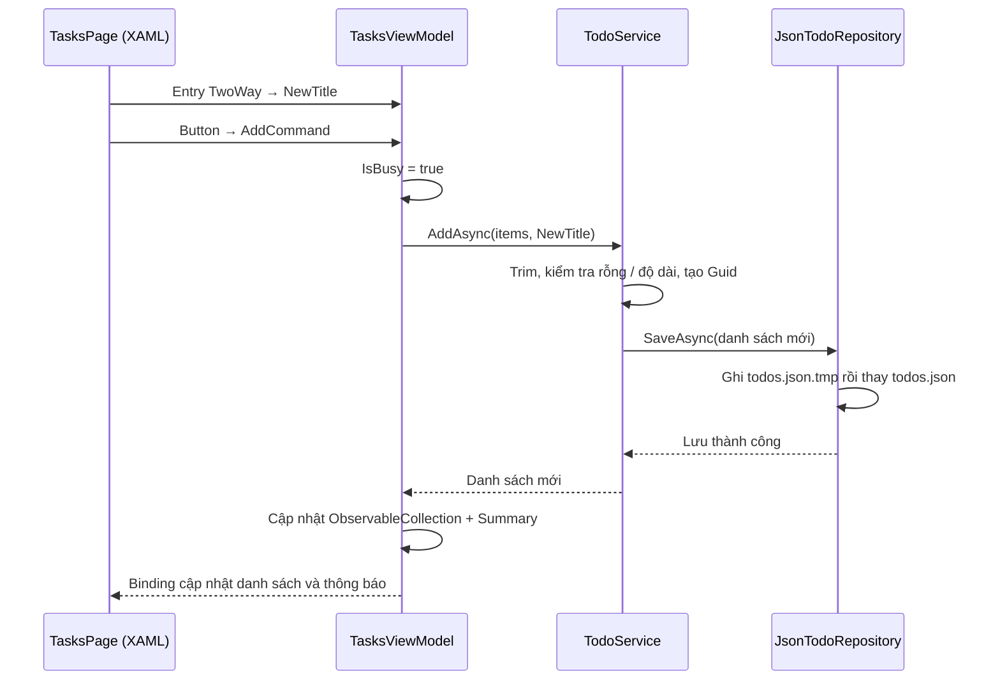

# Việc nhỏ — học .NET MAUI bằng một app Android

Một ứng dụng MAUI native, C# + XAML, dành cho người mới. Có **một project ứng dụng** `MauiBasics.csproj`; thư mục `tests` là bộ kiểm thử hỗ trợ chạy riêng trên .NET. Không phụ thuộc app `MauiApp1` ở thư mục cha.

- **Việc nhỏ:** nhập tên việc, thêm, hoàn thành/làm lại, xóa có xác nhận. Tự lưu trên máy sau mỗi thay đổi.
- **Khám phá:** chạm tăng bộ đếm, đặt lại và xem thông tin thiết bị Android thật qua `DeviceInfo`.
- Giao diện tiếng Việt, sáng/tối theo hệ thống, chữ theo cỡ chữ Android, nhãn trợ năng và thông báo cho TalkBack.

## 1. Chạy ngay

Yêu cầu: .NET SDK 10, workload MAUI, Android SDK API 36/build-tools 36, **JDK 21**, emulator hoặc điện thoại Android 7/API 24 trở lên. Nếu mở trong Visual Studio, dùng bản hỗ trợ .NET 10 và workload .NET MAUI.

Từ thư mục gốc repository, trong PowerShell:

```powershell
cd Mobile
dotnet --info
dotnet workload list
.\Build-Android.ps1
```

Script sử dụng `ANDROID_HOME`/`JAVA_HOME` nếu có; nếu không, tìm SDK ở `%LOCALAPPDATA%\Android\Sdk` và JDK ở `%LOCALAPPDATA%\Android\jdk\jdk-21`. Nếu máy đặt ở nơi khác hoặc `JAVA_HOME` đang trỏ JDK 17:

```powershell
.\Build-Android.ps1 -AndroidSdkPath 'C:\duong-dan\Android\Sdk' -JavaSdkPath 'C:\duong-dan\jdk-21'
```

APK cài trực tiếp: `Mobile/artifacts/ViecNho-debug.apk`. Bật emulator trong Android Device Manager, hoặc bật USB debugging trên điện thoại rồi kết nối:

```powershell
adb devices
adb install -r .\artifacts\ViecNho-debug.apk
```

Mở **Việc nhỏ** từ danh sách ứng dụng. Nếu có nhiều thiết bị, thêm `-s <serial>` sau `adb`. Không cần backend, Internet hay tài khoản.

Cách dùng Visual Studio: mở `Mobile/MauiBasics.slnx`, chọn project `MauiBasics`, chọn emulator/điện thoại Android, nhấn F5. Có thể sửa XAML khi debug bằng Hot Reload.

Lệnh CLI tương đương nếu SDK/JDK đã được cấu hình đúng:

```powershell
dotnet build MauiBasics.csproj -c Debug
dotnet build MauiBasics.csproj -t:Run -c Debug
```

## 2. Bản chất MAUI là gì?

MAUI cung cấp **một API C# để tạo giao diện native trên nhiều nền tảng**. Ví dụ `Button` trong XAML được một **handler** nối với control Android bên dưới. Ở app này, giao diện không chạy trong trình duyệt hay WebView.

XAML là cách mô tả cây giao diện. C# tạo trạng thái và xử lý hành vi. Hai phần nối với nhau qua binding. `InitializeComponent()` nạp phần giao diện được sinh từ XAML; `x:Class` nối XAML với lớp `partial` trong `.xaml.cs`.

MAUI **không bắt buộc MVVM**, DI hay Clean Architecture. Đây là cách tổ chức mã của ví dụ để nhìn rõ trách nhiệm; bạn hoàn toàn có thể viết một app MAUI nhỏ bằng C# và event `Clicked`.

Project này chỉ target `net10.0-android` để học tập trung. C# dùng chung không có nghĩa APK chạy được trên iPhone: muốn thêm iOS/Windows cần target tương ứng, entrypoint, công cụ build của nền tảng đó và kiểm thử lại.

## 3. Bắt đầu đọc từ bộ đếm

Mở theo thứ tự:

1. `Views/LearnPage.xaml`: `Label Text="{Binding Count}"` và `Button Command="{Binding IncrementCommand}"`.
2. `Views/LearnPage.xaml.cs`: `BindingContext` cho biết binding cần tìm thuộc tính ở object nào.
3. `ViewModels/LearnViewModel.cs`: Command tăng `Count`; setter gọi `SetProperty`.
4. `ViewModels/ObservableObject.cs`: phát event `PropertyChanged` để MAUI biết cần đọc lại thuộc tính.

```text
Chạm Button
    → IncrementCommand.Execute()
    → Count tăng
    → PropertyChanged("Count")
    → Binding đọc lại Count
    → Label / control Android cập nhật
```

**Không có vòng lặp tự quét mọi biến C#.** Nếu gán trực tiếp `_count++` mà không báo `PropertyChanged`, dữ liệu có thể đổi nhưng Label không tự cập nhật.

`x:DataType` giúp trình biên dịch kiểm tra đường dẫn binding; nó **không tự tạo BindingContext**. Dữ liệu thật vẫn được gán trong constructor trang.

`DeviceInfo` minh họa API nền tảng: cùng một lời gọi C#, MAUI chọn implementation Android để lấy hãng máy, model và phiên bản hệ điều hành.

## 4. Ai khởi động app?

```text
Android
  → Platforms/Android/MainApplication.cs
  → MauiProgram.CreateMauiApp()       đăng ký app + dependency injection
  → App.xaml / App.xaml.cs           nạp resources, tạo Window
  → AppShell.xaml / AppShell.xaml.cs tạo thanh hai tab
  → TasksPage hoặc LearnPage         hiển thị UI, gán BindingContext
```

`MainActivity` là Activity launcher của Android, dùng `MauiAppCompatActivity` để host UI MAUI. `MainApplication` là cầu nối tạo MAUI app; chúng có vai trò khác nhau.

`MainActivity` còn dùng API Android để đổi màu icon thanh trạng thái theo theme. Đây là ví dụ phần native nhỏ nằm ở `Platforms/Android`, bên cạnh giao diện XAML dùng chung.

`App` chỉ resolve `AppShell` ở `CreateWindow`, sau `InitializeComponent()`. Nếu inject trực tiếp Shell và các trang vào constructor App, DI có thể tạo trang trước khi resources của Application tồn tại, gây lỗi `StaticResource not found`. Đây là khác biệt giữa build thành công và chạy được trên thiết bị.

`MauiProgram` là nơi ghép các thành phần. Khi DI tạo `TasksPage`, nó tạo/lấy `TasksViewModel`, rồi `TodoService`, rồi implementation `JsonTodoRepository` của `ITodoRepository`. Không cần tự `new` cả chuỗi trong trang.

ViewModel và repository dùng `AddSingleton`, sống trong phạm vi tiến trình ứng dụng. Vì vậy bộ đếm giữ khi đổi tab. Trang và Shell dùng `AddTransient`: mỗi lần tạo Window sẽ có View/handler mới. Điều này tránh dùng lại handler đã bị Android hủy khi Activity được tạo lại, chẳng hạn lúc đổi cỡ chữ. Khi Android kết thúc tiến trình, bộ đếm trở về 0; **singleton không phải lưu dữ liệu lâu dài**.

## 5. Theo dõi một lần “Thêm việc”



Nếu lưu thất bại, danh sách cũ và nội dung đang nhập được giữ lại. App chỉ hiển thị thay đổi sau khi lưu thành công; trong lúc tải/lưu, lệnh sửa bị khóa. Xóa dùng hộp thoại native trong code-behind vì đó là hành vi giao diện.

Phân biệt hai loại thông báo:

| Cơ chế | Tác dụng trong app |
| --- | --- |
| `INotifyPropertyChanged` | Báo một thuộc tính thay đổi: `Count`, `Summary`, `IsBusy`... |
| `ObservableCollection` | Báo danh sách thêm/xóa phần tử để `CollectionView` cập nhật |
| `Command.ChangeCanExecute()` | Báo Button kiểm tra lại việc được phép bấm hay không |

`TodoItem` bất biến (`record`): khi hoàn thành, service tạo bản mới bằng `with`. VM dựng lại các hàng từ danh sách đã lưu. Vì thế không cần `PropertyChanged` trên từng model; cách này dễ đọc cho danh sách nhỏ, nhưng có thể mất vị trí cuộn khi thay toàn bộ danh sách. App lớn nên cập nhật từng hàng theo ID.

## 6. Cấu trúc và hướng phụ thuộc

```text
Mobile/
├── MauiBasics.csproj / MauiBasics.slnx
├── MauiProgram.cs                 Ghép DI
├── App.xaml(.cs)                  Resources + Window
├── AppShell.xaml(.cs)             Điều hướng hai tab
├── Platforms/Android/            Điểm vào Android + manifest
├── Views/                        XAML, vòng đời, hộp thoại, trợ năng
├── ViewModels/                   Trạng thái UI + Command
├── Domain/                       Model, quy tắc, interface lưu trữ
├── Data/                         Lưu/đọc JSON
├── Resources/                    Màu, style, icon SVG
├── tests/                        Test domain, persistence, ViewModel
├── Build-Android.ps1              Build và xuất APK
└── README.md
```

```text
Views → ViewModels → Domain
Data ─────────────→ Domain
MauiProgram → ghép tất cả bằng DI
```

Domain không tham chiếu MAUI hay Android. Interface repository nằm ở Domain; Data triển khai nó. Đây là nguyên tắc đảo chiều phụ thuộc, áp dụng bằng C# thay vì Kotlin. Chỉ dùng thư mục trong một app project, chưa tách nhiều assembly.

`TodoService` gom ba use case nhỏ để dễ đọc. Chưa cần generic repository, mediator, database hay framework MVVM. Nếu thêm server sau này, bạn có thể thay implementation `ITodoRepository`; cần thiết kế riêng đồng bộ và xung đột dữ liệu, không chỉ thay một URL.

## 7. Dữ liệu và vòng đời

`FileSystem.AppDataDirectory/todos.json` thuộc vùng riêng của ứng dụng; không cần quyền truy cập bộ nhớ chung. Ghi sau mỗi thao tác, không chờ `OnDisappearing` hoặc app đóng vì Android có thể kết thúc tiến trình bất cứ lúc nào.

- `OnAppearing` tải lần đầu; lần sau giữ ViewModel hiện có.
- JSON dùng metadata sinh lúc build để tương thích trimming.
- Tệp thiếu: xem là lần mở đầu, danh sách rỗng.
- JSON lỗi: báo lỗi và khóa sửa; không tự ghi danh sách rỗng đè lên tệp cũ.
- Lỗi ghi: báo lỗi và giữ nguyên UI trước thao tác.
- Gỡ app hoặc chọn **Xóa bộ nhớ / Clear storage** sẽ mất danh sách; không có cloud backup.

Để xem dữ liệu của bản Debug bằng ADB:

```powershell
adb shell run-as com.learning.viecnho cat files/todos.json
```

Nếu cố tình sửa hỏng JSON để học: sao lưu nội dung trước, khôi phục tệp rồi bấm **Thử tải lại**. Nếu chỉ là dữ liệu thử và muốn làm lại từ đầu, dùng cài đặt Android → Ứng dụng → Việc nhỏ → Bộ nhớ → Xóa bộ nhớ. Hành động này xóa toàn bộ dữ liệu app.

## 8. Tự kiểm tra và bài tập

```powershell
dotnet test .\tests\MauiBasics.Tests.csproj
.\Build-Android.ps1 -Configuration Release
```

Tests chạy trên .NET, dùng mã nguồn thật được link vào project test: CRUD qua lần đọc mới, Unicode, nhập rỗng, giới hạn 100 ký tự, JSON lỗi, lỗi lưu, chạm thêm liên tiếp, tải lại. Chúng không thay thế kiểm tra UI trên Android.

Có thể chạy smoke test sau khi cài **APK Debug**, cần Python 3 và `adb` trong PATH:

```powershell
python .\tests\android_smoke.py --serial emulator-5554
```

Script tạo việc thử có tiền tố `MAUI smoke`, thao tác trên UI và kiểm tra JSON thật, rồi xóa việc thử. Dùng `--probe` để chỉ chụp/đọc giao diện hiện tại. Kết quả và ảnh ở `artifacts/android`; báo cáo lần kiểm tra bàn giao nằm trong `VERIFICATION.md`.

Thử thủ công: thêm hai việc trùng tên → hoàn thành một việc → đóng tiến trình rồi mở lại → xóa và thử hủy xóa → đổi tab và thử bộ đếm. Thử thêm cỡ chữ lớn, theme tối và TalkBack trong cài đặt Accessibility. Chỉ kiểm thử TalkBack thực tế mới xác nhận được chất lượng đọc/focus, các thuộc tính XAML tự chúng chưa chứng minh điều đó.

Bài tập theo thứ tự tăng dần:

1. Đổi số cộng trong `IncrementCommand` thành 2.
2. Bỏ thông báo thay đổi `Count`, chạy lại và quan sát UI.
3. Thêm mô tả phụ vào `TodoItem`, rồi nối Entry → ViewModel → service → JSON.
4. Thêm bộ lọc “Chưa hoàn thành” mà không xóa dữ liệu đã hoàn thành.
5. Thử repository chỉ giữ dữ liệu trong RAM và so sánh sau khi khởi động lại.

Giới hạn chủ ý: danh sách nhỏ lưu nguyên file, một tiến trình và một cửa sổ, chưa có đồng bộ nhiều thiết bị. APK xuất bởi script phục vụ học/thử; xuất bản lên Play Store cần signing key riêng và cấu hình phát hành phù hợp.
