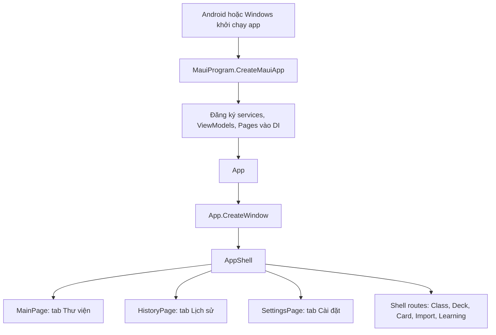
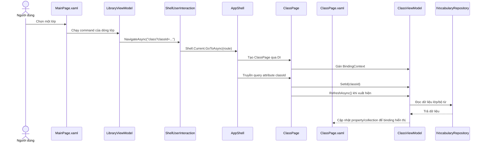

# Luồng hoạt động của project MAUI

> Tài liệu này giải thích cấu trúc và luồng chạy của project VocabMate hiện tại. Project target Android và Windows trên .NET 10.

## 1. Bức tranh tổng thể

MAUI cho phép dùng chung phần lớn giao diện và logic C# giữa nhiều nền tảng. Khi build, project chọn một target cụ thể, chẳng hạn Android hoặc Windows, rồi kết hợp phần dùng chung với phần riêng của target đó.

## 2. Luồng khởi động

1. Hệ điều hành khởi chạy app qua entry point của nền tảng. Android có `Platforms/Android/MainActivity.cs` và `MainApplication.cs`; Windows có cấu hình khởi chạy riêng trong `Platforms/Windows`.
2. MAUI gọi `MauiProgram.CreateMauiApp()` trong `MauiProgram.cs`.
3. `MauiProgram` cấu hình fonts, handlers và đăng ký các đối tượng vào dependency injection (DI), gồm repository, services, ViewModels, Pages và `AppShell`.
4. `App` nhận các dependency qua constructor. `CreateWindow()` tạo một `Window` chứa `AppShell`.
5. `AppShell.xaml` khai báo ba tab chính. `AppShell.xaml.cs` gắn các page vào tab và đăng ký các route cho màn hình còn lại.

## 3. MVVM trong project này

Project dùng mô hình **MVVM (Model–View–ViewModel)** với `Command`/`ICommand` và `INotifyPropertyChanged` của MAUI; hiện không dùng CommunityToolkit.Mvvm.

| Thành phần | Vai trò | Ví dụ trong project |
| --- | --- | --- |
| View | Mô tả giao diện và binding dữ liệu/lệnh | `MainPage.xaml`, `Views/ClassPage.xaml` |
| Code-behind | Khởi tạo View, gắn BindingContext, xử lý sự kiện/lifecycle hoặc tương tác layout | `MainPage.xaml.cs`, `Views/ClassPage.xaml.cs` |
| ViewModel | Giữ trạng thái hiển thị, cung cấp property và command, phối hợp service | `ViewModels/LibraryViewModel.cs` |
| Model | Biểu diễn dữ liệu và kết quả nghiệp vụ | `Models/VocabularyData.cs` và các model khác |
| Service/repository | Đọc, ghi dữ liệu hoặc thực hiện nghiệp vụ | `Services/IVocabularyRepository.cs`, `JsonVocabularyRepository.cs`, `LearningEngine.cs` |

### Ví dụ: màn hình thư viện

- `MainPage.xaml` khai báo giao diện. Các binding như `Classes`, `ClassCount`, `ResumeCommand` lấy từ ViewModel.
- Constructor trong `MainPage.xaml.cs` nhận `LibraryViewModel` từ DI, gọi `InitializeComponent()` để nạp XAML, rồi gán `BindingContext`.
- Khi trang xuất hiện, `MainPage.OnAppearing()` gọi `viewModel.RefreshAsync()` để nạp lại dữ liệu.
- `LibraryViewModel` lấy dữ liệu qua `IVocabularyRepository`, cập nhật property/collection và cung cấp các command cho View.
- Binding nối UI với ViewModel: dữ liệu thay đổi thì UI được thông báo cập nhật; người dùng bấm nút thì command tương ứng chạy.

`x:DataType="vm:LibraryViewModel"` trong XAML khai báo kiểu của binding context, giúp XAML binding được kiểm tra/biên dịch theo kiểu mạnh.

Code-behind không đồng nghĩa với việc project không dùng MVVM. Trong project này, code-behind còn xử lý những việc gắn trực tiếp với View như lifecycle, thay đổi bố cục theo kích thước cửa sổ, focus và keyboard. State và nghiệp vụ của màn hình chủ yếu nằm trong ViewModel/service.

## 4. Một luồng điều hướng cụ thể

Ví dụ mở một lớp học từ thư viện:

`AppShell` đăng ký route `class` với `ClassPage`. `ClassPage` nhận `ClassViewModel` qua constructor; `ApplyQueryAttributes()` chuyển `classId` sang ViewModel. Luồng tương tự được dùng cho deck, card, import và learning.

## 5. DI và vòng đời đối tượng

Đăng ký tại `MauiProgram.cs` quyết định DI tạo và dùng lại đối tượng thế nào:

- `AddSingleton`: một instance dùng chung trong suốt vòng đời app/container, ví dụ repository, `LibraryViewModel` và các page tab chính.
- `AddTransient`: tạo instance mới mỗi lần được yêu cầu, ví dụ `ClassViewModel`, `DeckViewModel` và các page theo route.

Khi một page có constructor nhận ViewModel, DI tự cung cấp ViewModel cùng các dependency của nó. Nhờ vậy, page không cần tự `new` repository hoặc tự tạo chuỗi đối tượng phụ thuộc.

## 6. XAML dùng chung và phần riêng nền tảng

Tên file kiểu `Page.xaml.Android` hoặc `Page.xaml.Windows` **không phải quy ước bắt buộc của MAUI**. MAUI thường dùng một XAML chung cho UI, rồi tách phần thật sự phụ thuộc nền tảng bằng C#, handler, tài nguyên hoặc cấu hình build.

Trong project này:

- `.xaml` chứa layout dùng chung, ví dụ `Views/InteractionDialog.xaml`.
- `.xaml.cs` là partial class đi kèm XAML, ví dụ `Views/InteractionDialog.xaml.cs`.
- `.Android.cs` và `.Windows.cs` là các phần C# platform-specific của cùng partial class, không phải XAML.
- Các file này dùng `#if ANDROID` hoặc `#if WINDOWS` để chỉ biên dịch phần phù hợp với target đang build.
- `Platforms/Android` và `Platforms/Windows` chứa startup, manifest hoặc cấu hình/tài nguyên dành riêng cho nền tảng.
- `MauiApp1.csproj` khai báo target framework `net10.0-android` và `net10.0-windows10.0.19041.0`; target đang build quyết định nhánh platform nào được chọn.

Ví dụ `InteractionDialog`:

1. `InteractionDialog.xaml` định nghĩa nội dung và bố cục dialog.
2. `InteractionDialog.xaml.cs` tạo các loại dialog, quản lý kết quả, focus và trạng thái dùng chung.
3. `InteractionDialog.Android.cs` trình bày ContentView bên trong Android native `Dialog`.
4. `InteractionDialog.Windows.cs` trình bày cùng nội dung bằng Windows `Popup`, đồng thời xử lý focus/keyboard theo Windows.

Lợi ích là bố cục và nội dung được chia sẻ, còn phần hiển thị native được đặt ở đúng nơi cần thiết. Không nên tách code theo nền tảng nếu hành vi chung đã đáp ứng yêu cầu.

## 7. Nên tìm file ở đâu?

| Muốn thay đổi… | Bắt đầu tìm ở… |
| --- | --- |
| Bố cục, control, binding của màn hình | `Views/*.xaml` hoặc `MainPage.xaml` |
| State, command, quy tắc của màn hình | `ViewModels/*ViewModel.cs` |
| Dữ liệu và cấu trúc model | `Models/` |
| Lưu/đọc dữ liệu, điều hướng qua abstraction, nghiệp vụ dùng chung | `Services/` |
| Control tái sử dụng hoặc handler | `Controls/` |
| Tab, route và cấu hình Shell | `AppShell.xaml`, `AppShell.xaml.cs` |
| DI, fonts và cấu hình khởi tạo MAUI | `MauiProgram.cs` |
| API/tài nguyên/cấu hình native | `Platforms/` hoặc `PlatformConfiguration/` |
| Hành vi chỉ dành cho Android/Windows của một View | File partial như `*.Android.cs`, `*.Windows.cs` |

### Quy tắc định hướng nhanh

- Nếu thay đổi **nội dung hiển thị**, xem XAML.
- Nếu thay đổi **trạng thái hoặc thao tác của màn hình**, xem ViewModel.
- Nếu thay đổi **đọc/ghi dữ liệu hoặc nghiệp vụ dùng chung**, xem service/repository.
- Nếu thay đổi **API hoặc tương tác native riêng**, xem platform-specific code/handler.

Khi debug binding, lần theo `Page.xaml` → `BindingContext` trong `.xaml.cs` → property/command ở ViewModel → service/repository mà ViewModel gọi.